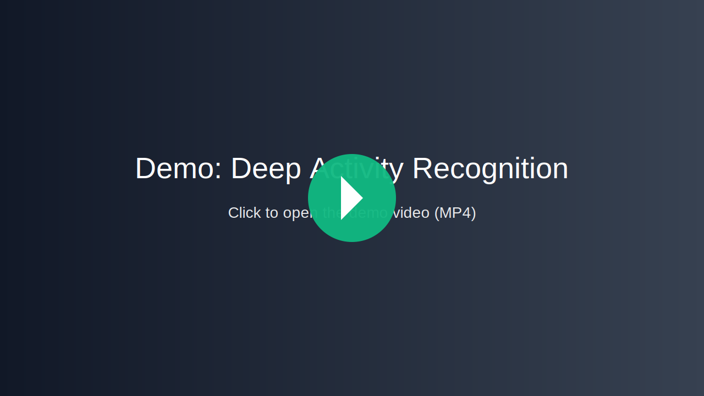
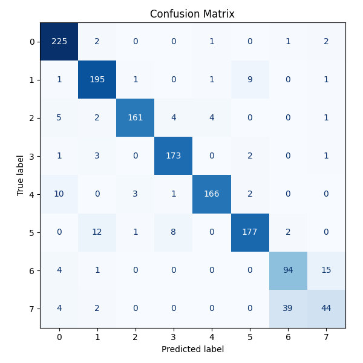

# Deep Activity Recognition ⚽️🏐

[](LICENSE)
[](https://www.python.org/)
[](#)
[](#)

A reproducible implementation of volleyball group activity recognition baselines from the referenced paper. The repository contains preprocessing tools, feature extraction, model implementations (image-level and multiple temporal baselines), training/evaluation pipelines, checkpointing and visualization utilities.

---

## Introduction ✨

This project implements a set of baseline models for group activity recognition in volleyball footage. The overall pipeline includes:
- data/annotation parsing and preprocessing,
- per-player and per-frame feature extraction (ResNet-50),
- several baseline model implementations (image-level, player-level, and multiple temporal architectures),
- training and evaluation utilities (logging, checkpoints, CSV metrics),
- visualization helpers for results and confusion matrices.

The codebase is organized to allow easy reproduction and extension of the baselines described in the paper.

---

## Demo 🎬


Watch the demo preview below.

[](assets/test_assets/test_demo.mp4)


You can also download the demo directly: [Download demo](assets/test_assets/test_demo.mp4)


---

## Features 🚀

- Preprocessing and annotation loaders for volleyball clips.
- Frame-level and player-crop data pipelines.
- Feature extraction pipeline using ResNet-50 (pretrained + fine-tuned).
- Multiple baseline models:
	- Baseline 1 — Image-level ResNet-50 fine-tuned on central frames.
	- Baseline 3 — Player-crop ResNet-50 fine-tuned on cropped players.
	- Baseline 4 — Frame-level LSTM on per-frame features.
	- Baseline 5 — LSTM on pooled 12-player features per frame.
	- Baseline 6 — Sequence model with pooled-player features and augmentations.
	- Baseline 7 — Two-stage: per-player LSTM → frame-level LSTM.
	- Baseline 8 — Team-pooled two-stage: per-player LSTM → team-level pooling → frame-level LSTM (uses pre-extracted features).
- Training helpers, checkpoint saving/loading and CSV logging.
- Visualization helpers for loss/accuracy curves and confusion matrices.

---

## Results 📊

Reported test accuracies (this implementation vs. original paper):

- Baseline 1 — 73.6%  (paper: 66.7%)
- Baseline 3 — 79.0%  (paper: 68.1%)
- Baseline 4 — 78.5%  (paper: 63.1%)
- Baseline 5 — 83.25% (paper: 67.6%)
- Baseline 6 — 81.6%  (paper: 74.7%)
- Baseline 7 — 85.7%  (paper: 80.2%)
- Baseline 8 — 89.5%  (paper: 81.9%)

Baseline 8 details: Team-pooled two-stage temporal model (per-player LSTM → team-level pooling → frame-level LSTM). Operates on pre-extracted player features (not end-to-end).

---

### Confusion Matrix — Baseline 8

Below is the confusion matrix for Baseline 8 (test set):




## Project Structure 📁

Top-level src layout (important parts):

- src/
	- Preprocessing/ — annotation parsing, box utilities, feature extraction helpers
	- stores/datasets/providers — ImagesDataset, FeaturesDataset and dataset provider factory
	- stores/models/providers/ — baseline model implementations (baseline1..baseline8)
	- trainers/ — training scripts for each baseline
	- utils/ — config, checkpoints, training/testing utilities, logging and visualization


## Installation ⚙️

Prerequisites
- Python 3.8+
- CUDA + PyTorch (GPU recommended for training)
- Recommended: create a virtual environment

Windows example (PowerShell / CMD):

1) Create and activate venv
```bash
python -m venv .venv
.venv\Scripts\activate
```

2) Install dependencies (example requirements, adapt as needed)
```bash
pip install -U pip
pip install torch torchvision numpy pandas matplotlib scikit-learn pillow tqdm
```

3) (Optional) Install this project as editable
```bash
pip install -e .
```

Note: The code uses a project-specific config loader (`src/utils/config_utils.py`). Update your paths and options in the configuration (or the environment) before running experiments.

---

## Usage 🧭

Quick overview of common workflows.

1. Prepare data and annotations
	 - Ensure videos and annotation files follow the expected layout (see Preprocessing and dataset loaders).
	 - Update data paths in the configuration (`src/utils/config_utils.py` or your config file).

2. Extract per-player or per-frame features (if required)
```bash
# Example (run corresponding script; scripts are under src/baselines/*)
python -m src.baselines.baseline3.extract_features   # (example location — check folder)
```

3. Train a baseline
```bash
# Example: train baseline1 (image-level finetune)
python -m src.baselines.baseline1.finetune_resnet50
```

4. Train other baselines
- Baseline3 (player crops): `src/baselines/baseline3/finetune_resnet50.py`
- Baseline4 (frame LSTM): `src/baselines/baseline4/train_lstm.py`
- Baseline5 (pooled players LSTM): `src/baselines/baseline5/train_lstm.py`
- Baseline6 (pooled-player experiments): `src/baselines/baseline6/train_lstm.py`
- Baseline7 (two-stage): `src/baselines/baseline7/train_lstm.py`
- Baseline8 (team-pooled two-stage using precomputed features): `src/baselines/baseline8/train_lstm.py`

5. Visualize results
- Use provided visualization helpers to generate plots (loss/accuracy curves and confusion matrices). Example calls are integrated into the trainer entrypoints (see individual baseline scripts).

Important notes:
- Most trainer scripts write CSV logs and model checkpoints. Inspect paths in the config to find outputs.
- Use GPU for reasonable training times; the code will fall back to CPU if CUDA is unavailable.

---

## Examples ✨

Typical training run (Windows):
```powershell
# Activate venv
.venv\Scripts\activate

# Train baseline3 (player-crop finetune)
python -m src.baselines.baseline3.finetune_resnet50
```

Inspect metrics after training:
- training CSVs: `logs/training_logs/`
- saved checkpoints: `models/`

Plot results:
- The visualize helper is called at the end of many trainer scripts or can be used standalone (see `src/helpers/visualize_helper.py`).

---

## License 📝

This project is provided under the MIT License. See LICENSE for details.
